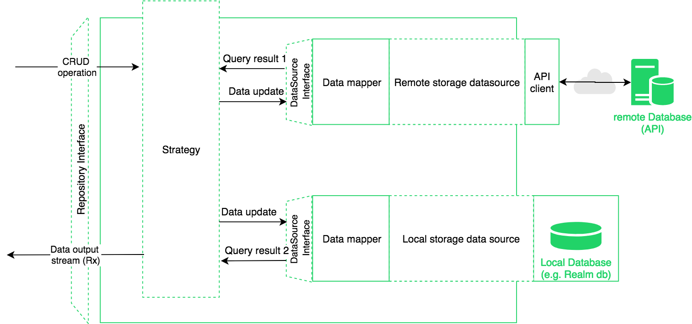

# RepoLib Rx - Android
[](https://github.com/netguru/repolib-android)

**RepoLib Rx** is an open-source library providing unified way for managing multiple DataSources in
Android applications based on Repository pattern and Rx streams.

It allows to setup unified strategy of request synchronization and reduce time needed to implement
 the synchronization logic on its own.

## How it works
The main goal of the library is to reduce time that is needed to implement data layer in Android
application that consists of two data sources. What you need to do to create data layer based
on **RepoLib** is:

1. Create data model entity
2. Implement Request Strategy Factory interface
3. Implement two DataSources:
 * remote DataSource
 * local DataSource
4. Initialize the library

For DataSource implementation you can use one of the most common libraries like e.g. [Retrofit](https://github.com/square/retrofit),
[Realm](https://realm.io/blog/realm-for-android/) or [Room](https://developer.android.com/topic/libraries/architecture/room).

RepoLibRx allows to synchronize requests between two data sources. All requests handled using Rx streams. 
The library has four input methods that return `Completable`'s from [RxJava 2](https://github.com/ReactiveX/RxJava). 
All methods send events that trigger following actions:
* `create(T)` - creates passed entity of type T
* `update(T)` - updates passed entity of type T
* `delete(Query)` - delete entity that matches passed `Query` object
* `fetch(Query)` - fetch all object that matches passed `Query` objects

All operations `Completable` will return complete event when operation succeed or return error on failure.
RepoLibRx object also contains one output method that returns `Flowable` with output data stream. 
This Flowable can be subscribed constantly because app will not return any kind of errors. 
It is designed to publish only data entities returned by data sources on certain input events.

### Architecture
The library is an generic implementation of the data layer for Android application based on
Repository pattern.


It is designed to manage synchronization of requests for two data sources - remote and local.
The requests will be passed to one of the mentioned data sources accordingly to the the rules
defined in Strategy factory.



### Features
As it was mentioned in previous section. RepoLibRx allows to perform typical CRUD operations 
using four input methods. It also allows to expect data entity updates in `Flowable` returned by 
fifth public method - `outputDataStream()`.
The library also supports data synchronization accordingly to the implemented RequestsStrategyFactory.
 To make implementation more easy we predefined few `RequestStrategy` objects that will cover most 
 common cases in data synchronization:
* OnlyLocal
* OnlyRemote
* Both
* LocalAfterFullUpdateWithRemote
* LocalOnRemoteFailure
* LocalAfterFullUpdateOrFailureOfRemote

All of the mentioned strategies describes the order of in which requests will be sent to the data 
sources. More information about can be found in KDoc
 [here](https://github.com/netguru/repolib-android/blob/master/repolib/src/main/kotlin/co/netguru/repolibrx/strategy/RequestStrategy.kt)

### Additional adapters
Such implementation of data sources can be very boring and repeatable. To make especially in cases
like Realm or Room. To reduce time to writing data source implementation we created two additional
adapters:
 * [Realm adapter](https://github.com/netguru/repolib-android/tree/master/realmadapter)
 * [Room adapter](https://github.com/netguru/repolib-android/tree/master/roomadapter)

Both of them contains simple implementation of DataSource interface with the basic operations.
The main purpose of this adapters is to reduce repeatable boilerplate code that is needed to
implement data sources.


## Download
To use this library in your project, add Netguru maven urls to the repositories block:
```
repositories {
    todo
}
```

### Data Source adapters
You can also use one of our adapters for Realm or Room.


#### Room DataSource (optional)
 To download Room adapter, add Netguru maven urls to the repositories block:
```
todo
```
For more information check readme file for [Room adapter module](https://github.com/netguru/repolib-android/tree/master/roomadapter)

#### Realm DataSource (optional)
To download Realm data source adapter add Netguru maven urls to the repositories block:
```
todo
```
For more information check readme file for [Realm adapter module](https://github.com/netguru/repolib-android/tree/master/realmadapter)

## Usage
To use **RepoLibRx** you need to first download the library from Maven repository
(check *Download* section).

To use RepoLibRx as your data layer for your data model you need to follow this steps:

1. Create data model entity. e.g.
```
data class DemoDataEntity(val id: Long, val value: String)
```

2. Implement Request Strategy Factory interface
 * implement it on your own
 ```
class DemoAppRequestStrategyFactoryFactory : RequestsStrategyFactory {

     override fun <T> select(request: Request<T>): Strategy = when (request) {
         is Request.Create -> RequestStrategy.OnlyRemote
         is Request.Update -> RequestStrategy.OnlyRemote
         is Request.Delete -> RequestStrategy.OnlyRemote
         is Request.Fetch -> RequestStrategy.LocalAfterFullUpdateOrFailureOfRemote
        }
 }
 ```
  * or you can skip this and use **[default](https://github.com/netguru/repolib-android/blob/master/repolib/src/main/kotlin/co/netguru/repolibrx/strategy/DefaultRequestsStrategyFactory.kt)**
   RequestsStrategyFactory already implemented in RepoLib module.


3. Implement two DataSource interfaces:
 * **remote** DataSource
 Example of DataSource interface implementation based on [Retrofit](https://github.com/square/retrofit)
```
class RetrofitDataSource(private val api: API) : DataSource<DemoDataEntity> {

    override fun create(entity: DemoDataEntity): Observable<DemoDataEntity> = api.create(entity)
    override fun update(entity: DemoDataEntity): Observable<DemoDataEntity> = api.update(entity)

    override fun delete(query: Query)
            : Observable<DemoDataEntity> {
        return if (query is QueryWithParams) {
            api.delete(id = query.param("id")).toObservable()
        } else {
            Observable.error(UnsupportedOperationException("Unsupported query: $query"))
        }
    }

    override fun fetch(query: Query): Observable<DemoDataEntity> = api.get()
            .flatMap { Observable.fromIterable(it) }
}
```

 * **local** DataSource
 Local data source can be implemented using manually or you can use one of our adapters that contains
  ready-to-use implementations of DataSource interface. You can use of two adapters:
  * **[Realm adapter](https://github.com/netguru/repolib-android/tree/master/realmadapter)**
  * **[Room adapter](https://github.com/netguru/repolib-android/tree/master/roomadapter)**

 If you decide to use one of our adapters you will only need to implement two interfaces that are
 responsible for mapping data and queries instead of implementing whole data source logic.
 For more information check Readme files for corresponding adapters.

4. Initialize the library
Initialize the library using already created components
```
val repoLibRx = createRepo {
        localDataSource = localDemoDataSource
        remoteDataSource = remoteDemoDataSource
        requestsStrategyFactory = demoAppRequestStrategyFactory
}
```

You can also skip assignment of *requestsStrategyFactory* to use default factory. You can also
initialize the library using constructor instead of using *createRepo* function


## License  
```
Copyright 2018 Netguru

Licensed under the Apache License, Version 2.0 (the "License");
you may not use this file except in compliance with the License.
You may obtain a copy of the License at

   http://www.apache.org/licenses/LICENSE-2.0

Unless required by applicable law or agreed to in writing, software
distributed under the License is distributed on an "AS IS" BASIS,
WITHOUT WARRANTIES OR CONDITIONS OF ANY KIND, either express or implied.
See the License for the specific language governing permissions and
limitations under the License.
```
